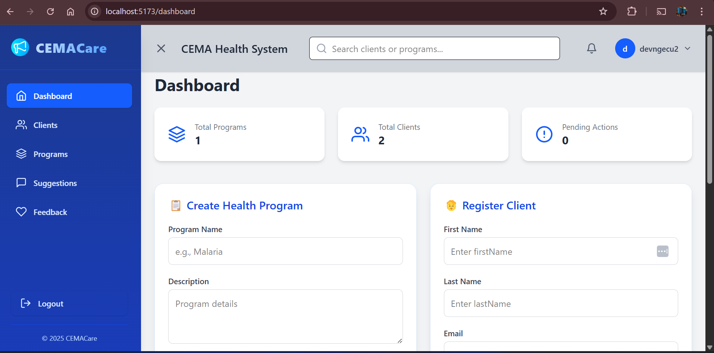

# CEMACare Health System



CEMACare is a full-stack web application designed to manage health programs, clients, feedback, and suggestions for healthcare providers. It features a responsive React frontend with a modern UI and a Node.js/Express backend with SQLite for data persistence. The application supports user authentication, program management, client registration, and data visualization through charts.

## Features

- **User Authentication**:

  - Login and signup functionality with JWT-based authentication.
  - Secure password hashing using `bcryptjs`.
  - Session management with token-based authorization.

- **Dashboard**:
  - Overview of total programs, clients, and pending actions.
  - Create new health programs and register clients.
  - Visualize program creation trends and client registrations with charts (LineChart, BarChart).

- **Clients Management**:
  - Register, view, edit, and delete clients.
  - Assign clients to health programs (many-to-many relationship).

- **Programs Management**:
  - Create, view, edit, and delete health programs.
  - Modal-based viewing and editing with form validation.

- **Feedback and Suggestions**:
  - Submit, view, and delete feedback and suggestions.
  - Filter suggestions by category and search by title.
  - Star-based rating system for feedback.

- **Responsive UI**:
  - Sidebar navigation with toggle functionality.
  - Topbar with user profile, search, and notifications.
  - Mobile-friendly design with Tailwind CSS.

- **Security**:
  - Rate limiting with `express-rate-limit`.
  - Helmet for HTTP headers security.
  - Input validation using `express-validator`.

- **Deployment**:
  - Deployed on Vercel with separate builds for frontend (`@vercel/static-build`) and backend (`@vercel/node`).

## Technologies

### Frontend
- **React**: JavaScript library for building user interfaces.
- **React Router**: For client-side routing.
- **TypeScript**: Adds static typing to JavaScript.
- **Tailwind CSS**: Utility-first CSS framework for styling.
- **Framer Motion**: For animations (e.g., sidebar transitions).
- **Axios**: For making HTTP requests to the backend.
- **React Toastify**: For displaying toast notifications.
- **Recharts**: For data visualization (charts).
- **React Icons**: For icons (e.g., `FiHome`, `FiUsers`).

### Backend
- **Node.js**: JavaScript runtime for the backend.
- **Express**: Web framework for building RESTful APIs.
- **Sequelize**: ORM for SQLite database management.
- **SQLite**: Lightweight database for development.
- **JWT (jsonwebtoken)**: For token-based authentication.
- **Bcryptjs**: For password hashing.
- **Express Validator**: For request validation.
- **Helmet**: For securing HTTP headers.
- **Express Rate Limit**: For rate limiting API requests.
- **CORS**: For enabling cross-origin requests.

### Deployment
- **Vercel**: Platform for hosting the frontend.
- **Render**: Platform for hosting the backend
- **Vite**: Build tool for the frontend.

## 📂 Project Structure

### Root
- `cemacare/`
  - `backend/` — Backend server
    - `config/db.js` — Sequelize database setup
    - `middleware/auth.js` — JWT authentication middleware
    - `models/` — Sequelize models (Client, Program, etc.)
    - `routes/` — API routes (auth, clients, etc.)
    - `server.js` — Backend entry point
  - `frontend/` — Frontend application
    - `src/` — Frontend source code
      - `assets/` — Static assets (images, logos, etc.)
      - `components/` — React components (Layout, Sidebar, etc.)
      - `context/` — React context providers
      - `pages/` — Pages (Dashboard, Login, etc.)
      - `types/` — TypeScript types
      - `App.tsx` — Main app component with routing
      - `index.css` — Global styles
      - `main.tsx` — React entry point
    - `index.html` — Vite HTML entry
    - `vite.config.ts` — Vite configuration
    - `vercel.json` — Vercel deployment config


## Prerequisites

- **Node.js**: Version 18.x or higher.
- **npm**: Version 8.x or higher.
- **Git**: For version control.
- **Vercel CLI**: For frontend deployment (`npm install -g vercel`).
- A Render account for backend deployment.
- A code editor (e.g., VS Code).

## Installation

### Frontend Setup
1. Clone the repository:
   ```bash
   git clone https://github.com/yourusername/cemacare.git
   cd cemacare/frontend

## License
© 2025 CEMACare. All rights reserved. For educational purposes only.


